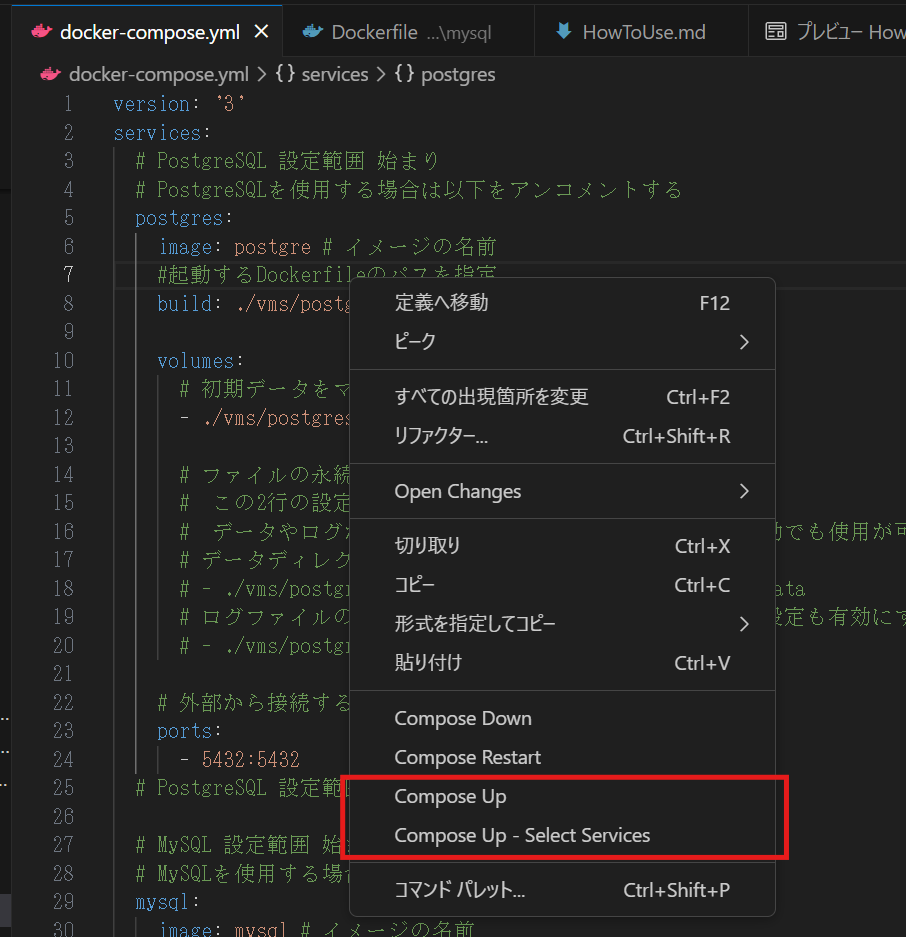
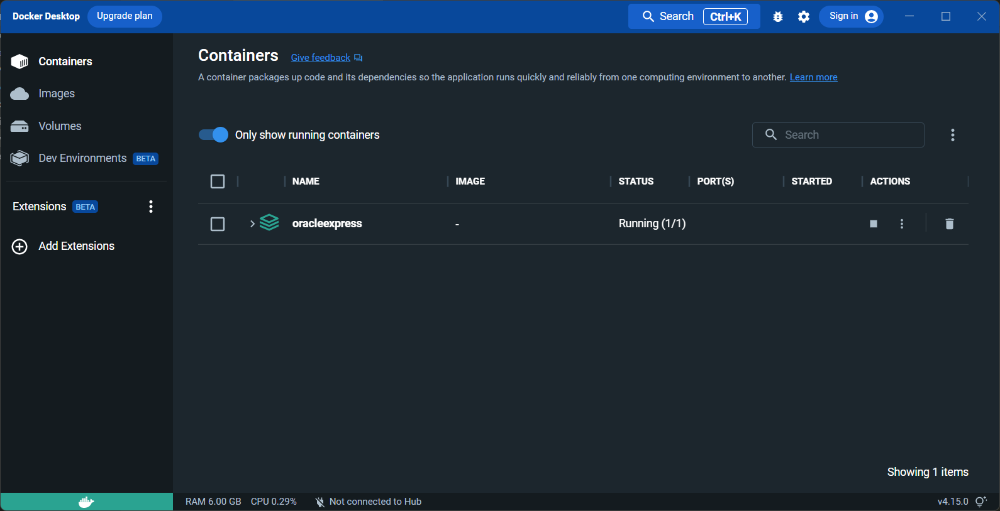
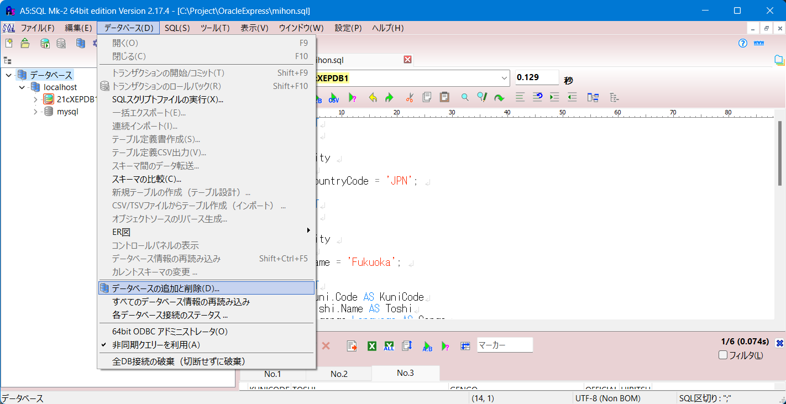
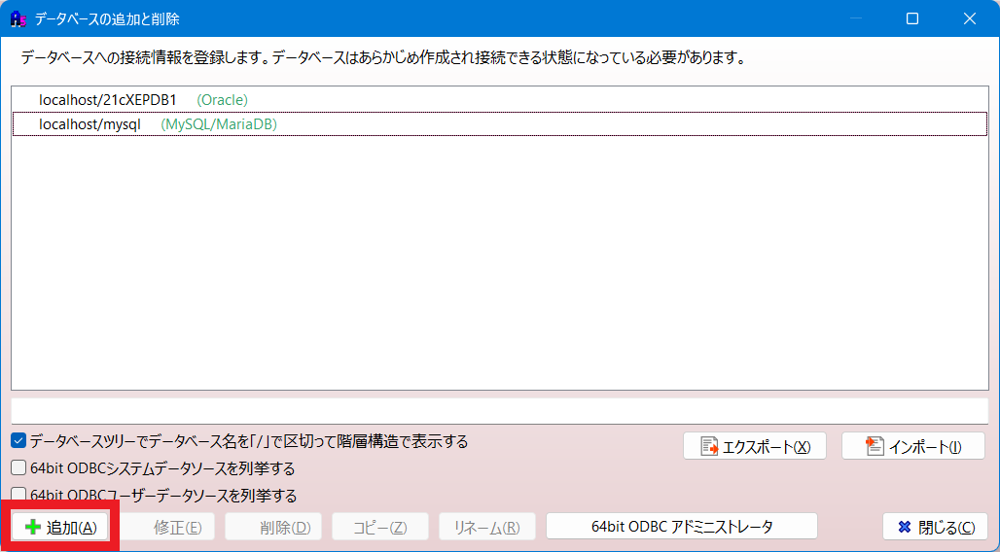
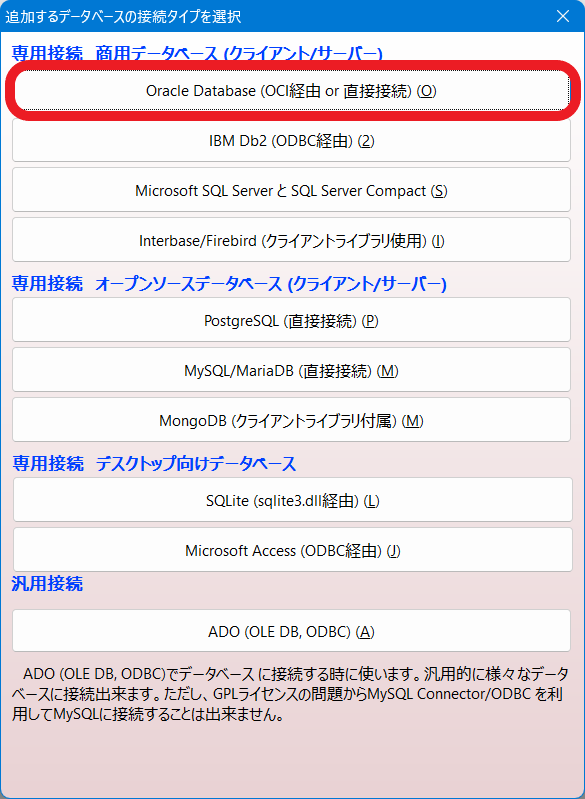
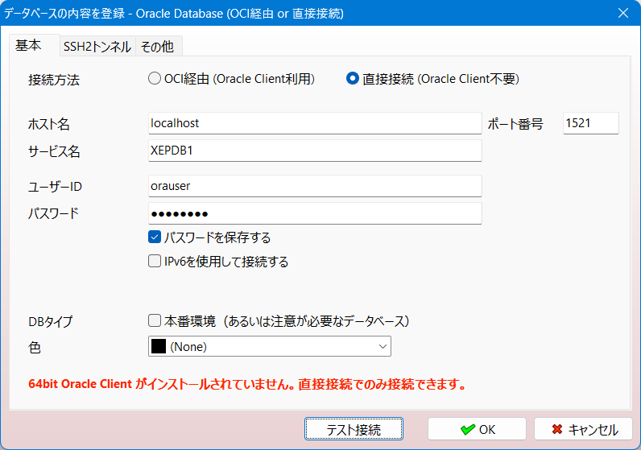
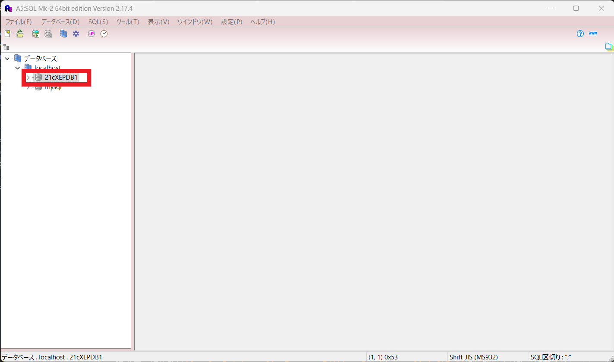

# DockerでSQLサーバを動かす

この環境はDockerを使用して以下のデータベースを利用できる必要最小限の設定と手順をまとめたものです。</br>前提としてなるべくコマンドラインでの操作をしなくて済むように考慮しています。

- MySQL
- Oracle (Express Edition)
- PostgreSQL</br>
(ABC順)

***

## 目次 <!-- omit in toc -->

- [DockerでSQLサーバを動かす](#dockerでsqlサーバを動かす)
  - [前提条件](#前提条件)
  - [環境構築](#環境構築)
    - [1.事前準備](#1事前準備)
    - [2.設定](#2設定)
    - [1. コンテナを起動する](#1-コンテナを起動する)
      - [1.1. 起動準備](#11-起動準備)
      - [1.2. コンテナの起動](#12-コンテナの起動)
      - [2.2. SQLサーバへの接続](#22-sqlサーバへの接続)
        - [2.2.1. SQLクライアントの起動](#221-sqlクライアントの起動)
        - [2.2.2. 接続先の設定](#222-接続先の設定)
      - [2.3. 接続したコンテナのデータベースにSQLを実行する](#23-接続したコンテナのデータベースにsqlを実行する)

***

## 前提条件

前提条件として以下のインストールと環境の構築が完了している必要があります。(Windowsの場合)

- Git for Windows
- Windows Subsystem for Linux(Version2以降、Windowsの場合)
- Docker Desktop
- Visual Studio Code

※Oracleを使用する場合はイメージをビルドして実行する必要があり、コマンドラインでの操作が必須となるため別にしています。

***

## 環境構築

環境を使用するには実行用の定義ファイルの取得を行います。</br>
必要に応じて設定ファイルの編集を行うことになりますが、編集しなくても実行ができるようにしています。

***

### 1.事前準備

SQLサーバを実行する定義はGitHubにコミット済みのファイルを取得します、取得したファイルにはデータベースを実行するのに必要最小限の設定が定義済みです。</br>
ただし、OracleのExpressEdtionを利用する場合は別紙のとおりイメージファイルの作成を行っておく必要があります。([別紙参照](./OracleExpress.md))

この環境定義は[Dovker HUB](https://hub.docker.com)よりイメージを取得して使用します。</br>そのため実際に使用するにはインターネットに接続された環境で起動時する必要があります。

***

### 2.設定

前項で取得したファイルの設定を確認します。
設定を簡略化したり、データの永続化（同じデータの再利用）を行う場合にはここで設定しておきます。
後から変更することも可能なのでまずは実行してみたいという場合はこの項をスキップすることも可能です。
docker-compose.yml を開いて実行したいSQLのコメントを解除します。
このステップでの設定は省略しても構いません、都度確認となりますが起動時に実行したいSQLサーバを指定する操作が可能なので設定ファイルの編集に不安を感じる場合は省略してください。

```
#### PostgreSQL 設定範囲 始まり
#### PostgreSQL 設定範囲 終わり
```

```
#### MySQL 設定範囲 始まり
#### MySQL 設定範囲 終わり
```

### 1. コンテナを起動する

Dockerコンテナを起動します。</br>
手順通りに設定が完了して、Visual Studio Codeが起動できてこのファイルを開くことができていればあとは比較的簡単です。
Visual Studio Code から起動すれば簡単にコンテナのDBに接続してSQLの実行が可能です。

#### 1.1. 起動準備

使用するデータベースを実行可能となるよう設定します。
そのままでもPostgreSQL、MySQLは起動できますし、どちらか一方のみを起動させることも可能です。</br>
起動する対象を絞り込む場合は **docker-compose.yml** を編集して使用しないSQLサーバの設定をコメントアウトします。
別途記載しているOracleDB Express Editionを使用する場合やPostgreSQL、MySQLのいずれか一方のみしか使用しない場合はdocker-compose.ymlを編集して必要なコンテナのみ起動されるように設定します。
基本的には使用するDB以外の記述をコメントアウトすればよいようになっています。</br>
※OracleDBについては別途用意している手順に従ってファイルを取得してイメージファイルをビルドする必要があります。

#### 1.2. コンテナの起動

Gitにて取得したファイルを保存しているフォルダを`Visual Studio Code`で開き、コンテナの定義である`docker-compose.yml`ファイルを右クリックして`Compose Up`を実行します。</br>
（`Visual Studio Code`はフォルダ内で右クリックして`shift + 右クリック`から`Codeで開く`で起動することもできます。）</br>
右クリックで表示されるダイアログにはコンテナを停止する`Compose Down`や再起動する`Compose Restart`もあります。
ダイアログの中にある`Compose Up - Select Services`を選択すると設定ファイル内で有効な設定から選択してDB（コンテナ）を起動できます。

<p align="center">
</br>
ダイアログを表示している状態
</p>

起動が完了すると`Visual Studio Code`の`CONTAINERS`や`Docker`の`Containers`で確認が可能です。</br>
初回の起動ではOracleのデータ領域の作成が行われるため環境によりますが10分前後は必要となります。

所要時間はテーブルの作成やデータの操作スクリプト(.sqlファイル）を自動で実行するフォルダに配置されているファイルの内容により変化します。</br>
`docker-compose.yml`の定義により初回の起動は`db-init`に、2回目以降は`db-update`に配置されているファイルが起動時に実行されます。

<p align="center">
</br>
DockerのContainersに起動されたコンテナが表示されている。ここからログの確認も可能です。
</p>

ログファイルで以下の表示が確認できれば起動できています。

```
#########################
DATABASE IS READY TO USE!
#########################
```

---

#### 2.2. SQLサーバへの接続

起動したコンテナのSQLサーバへ接続します。各データベースアプリケーションには専用のSQLクライアントソフトがありますがどのサーバにも接続可能な汎用のクライアントソフトもあります。</br>
`A5:SQL Mk-2`などライセンス不要で使用でき、`Microsft Store`からも入手できるものもありますので好みのものを探してみましょう。</br>
`Visual Studio Code`のターミナルを使用して直接SQLを実行することも可能です。


接続の設定と起動時に自動処理で登録させたサンプルのテーブルを使用した見本のSQLを実行するまでを紹介します。

接続設定は以下のようになります。</br>
`docker-compose.yml`や`db-init`の中に定義していますので変更することが可能です。

MySQL
```
接続先（ホスト名）：localhost
接続ポート：3306
データベース名：todoufuken
ユーザ名：root
パスワード：dbpass
```

Oracle Express
```
接続先（ホスト名）：localhost
接続ポート：1521
データベース名：XEPDB1
ユーザ名：orauser
パスワード：Passw0rd (6文字目はZERO)
```

PostgreSQL
```
接続先（ホスト名）：localhost
接続ポート：5432
データベース名：postgres
ユーザ名：postgres
パスワード：postgres
```

SQLクライアントは好みもありますので他のソフトやツールを使用する場合はこの設定を使用してください。

---

##### 2.2.1. SQLクライアントの起動
SQLクライアントを使用した接続例です。画面は`A5:SQL Mk-2`による例です。設定ができていれば画面はどのSQLサーバでも同じです。

---

##### 2.2.2. 接続先の設定

`A5:SQL Mk-2`の画面で「データベース(D)」をクリックし、プルダウンから「データベースの追加と削除(D)」を選択します。画面はOracleDBのものになります。
<p align="center">
</br>
プルダウン表示
</p></br>

「データベースの追加と削除」ダイアログで左下の「追加(A)」を選択します。
<p align="center">
</br>
「データベースの追加と削除」ダイアログ表示
</p></br>

「追加するデータベースの接続タイプを選択」で接続するデータベースを選択します。
<p align="center">
</br>
</p></br>

「データベースの内容を登録」で接続に必要な情報を入力します。
<p align="center">
</br>
項番`2.2.`の接続設定の内容を入力
</p></br>
必要な設定ができていると「テスト接続」ボタンで接続の確認ができます、「接続に成功しました」と表示されたら「OK」ボタンで登録を行います。<br>
「データベースの内容を登録」で「OK」をクリックすると登録名の設定に移るので登録する名称を設定して完了させます。

接続が完了するとデータベースに`localhost`が追加されて登録した接続先名が表示されます。
<p align="center">
<br>
デフォルトの接続先名で登録した場合
</p></br>

---

#### 2.3. 接続したコンテナのデータベースにSQLを実行する

動作確認の最終段階として検索のサンプルSQL（`mihon.sql`）を実行します。

`A5:SQL Mk-2`で左側のデータベースの中から前の項番で登録した接続先をダブルクリックしてログインします。
<p align="center">
<br>
ログインのダイアログ。「接続」をクリックする。
</p><br>

接続が完了すると接続先にログインしたユーザ名が表示されるようになります。
<p/ align="center">
</br>
接続先名の横にユーザ名が表示され、ユーザ名と同じスキーマに接続している状態
</p></br>

`A5:SQL Mk-2`にエクスプローラなどからサンプルSQL（`mihon.sql`）をドロップするなどしてSQLを開きます。</br>
図中の赤枠部分がログインした接続先と異なる場合は使用する接続先に変更します。
<p/ align="center">
</br>
サンプルSQLを開いた状態。
</p></br>

サンプルSQL（`mihon.sql`）の中のいずれかのSQLにカーソルを置いて`Ctrl + Enter`でSQLを実行すると画面下部に結果が表示されます。<br>
`Ctrl + A`でSQLの全文を選択している状態で`Ctrl + Enter`にてSQLを実行すると3件あるSQLの結果がSQLごとにタブで表示されます。

<p/ align="center">

</p>
</br>
全文選択状態でSQLを実行した結果画面
</br>

SQLの結果が表示されたら動作確認までが完了しています。
