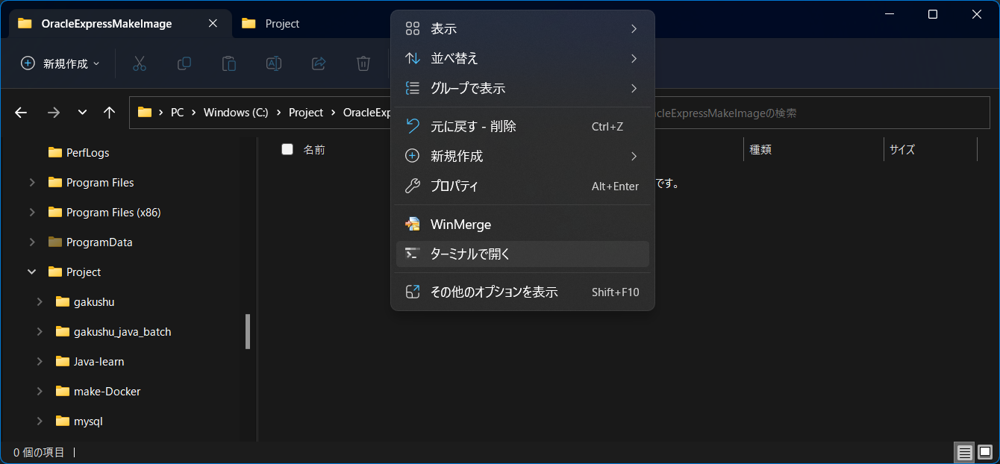
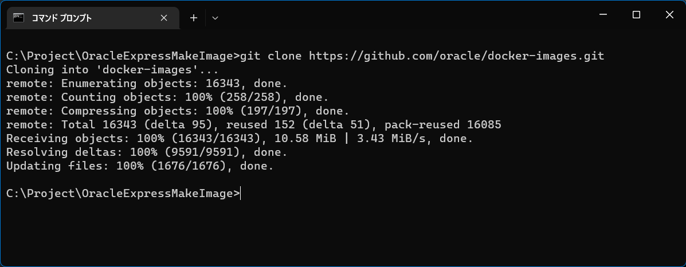
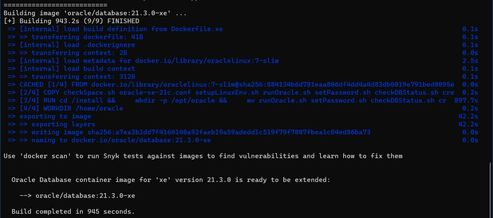
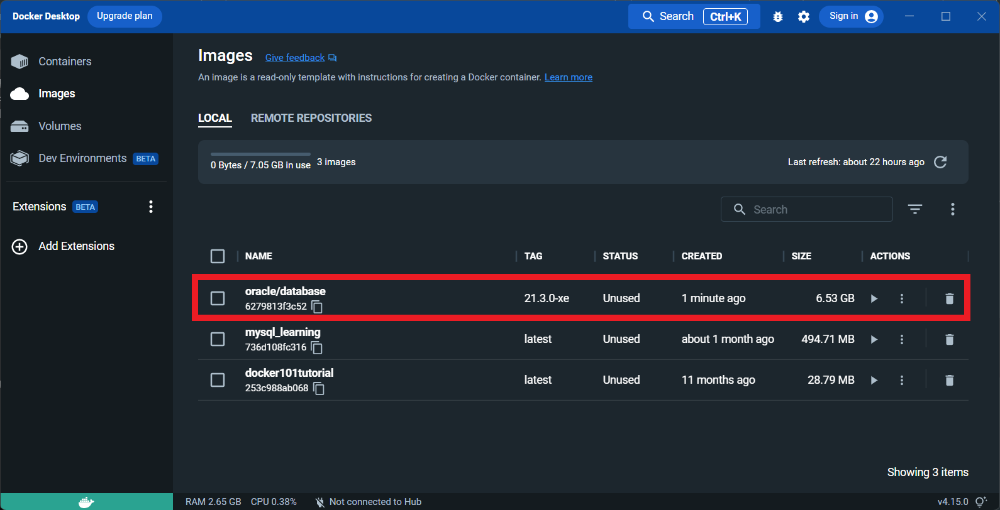

# Oracle(ExpressEcition)のイメージファイルを作成する
- [「DockerでSQLサーバを動かす」へ戻る](HowToUse.md)
***
## 目次 <!-- omit in toc -->
- [Oracle(ExpressEcition)のイメージファイルを作成する](#oracleexpressecitionのイメージファイルを作成する)
  - [環境構築](#環境構築)
    - [Oracleイメージの作成](#oracleイメージの作成)
      - [ビルド環境の取得](#ビルド環境の取得)
      - [イメージファイルのビルド](#イメージファイルのビルド)
  - [番外編](#番外編)
    - [ExpressEdition以外を利用する場合](#expressedition以外を利用する場合)
  - [参考URL](#参考url)

***
## 環境構築

### Oracleイメージの作成

Dockerではクラウド開発で使用される仮想環境が実行できるイメージがベンダーやオープンソース団体から多く提供されています、提供済みの場合は[hub.docker.com]()に登録されておりComposeやYamlファイルによるDockerの定義で指定するだけで使用できるようになっています。

しかし、Oracleのデータベースについてはイメージが提供されておらず、自身で必要なファイルをダウンロードして自身の手でイメージをビルドする必要があります。

---
#### ビルド環境の取得

エクスプローラで管理しやすいパスにイメージファイル用のフォルダを作成します。

<p align="center">
<br>
写真はターミナルを使用している場合、コマンドプロンプトをこのパスで開きます。
</p>

作成したフォルダ内でコマンドプロンプトもしくはWindows PowerShellで以下のコマンドを実行します。


```
git clone https://github.com/oracle/docker-images.git
```
以下のようになれば完了です。

<p align="center">
<br>
画面内のパーセント表示がすべて100％になっている。
</p>

---
#### イメージファイルのビルド

イメージファイルを作成します。

前の項番(1.1.)で使用したエクスプローラで実行します。
`Shift + [右クリック]`でダイアログを表示させを`「Linuxシェルをここに開く」`を選択します。

開かれたLinuxシェルのウィンドウで以下のコマンドを実行します。

```dotnetcli
cd ./docker-images/OracleDatabase/SingleInstance/dockerfiles
./buildContainerImage.sh -v 21.3.0 -x -i
```
コマンドを実行するとイメージの生成処理が開始されます。
完了すると以下のようなメッセージが表示されます。

<p align="center">
<br>
Linuxシェルの完了メッセージの表示
</p>


完了後には以下のようにDockerのImageタブにOracleイメージが表示されています。

<p align="center">
<br>
赤枠が追加されたOracleのイメージ
</p>

***
## 番外編
### ExpressEdition以外を利用する場合

環境構築でOracle Databaseイメージを作成するときに参考としたWebサイトではデータベースのインストールファイルをOracleの公式サイトから取得するように書かれています。
実際に動作確認で検証したところではExpressEditionではこの処理を実行することなくDockerイメージを作成できました。

この資料ではExpressEditionでの環境構築手順としてまとめていますがExpressEdition以外で環境を構築したい場合は以下のOracleのURLからExpress Editionのインストールファイルをダウンロードします。

構築する環境では`Oracle Database 21c Express Edition for Linux x64 ( OL7 )`にしているので一致するインストールファイルを選択してください。
    
こちらからライセンス規約などを確認してダウンロードします。
[Oracle Database Software Downloads](https://www.oracle.com/database/technologies/oracle-database-software-downloads.html)

ダウンロードしたファイルを項番`1.2.`を実行する前にシェルを実行する`dockerfiles`のパスにある対象のバージョン数字のフォルダにコピーします。
```dotnetcli
[項番1.1.で作成したイメージファイル用のパス]\docker-images\OracleDatabase\SingleInstance\dockerfiles
```
このパスには`21.3.0`や`19.3.0`といったOracleDatabaseのバージョンのフォルダがあるのでこの数字に合わせてコピーします。
    

***
## 参考URL
[Oracle Database 19c 環境をDockerで作成してSQL Developerで接続する](https://zenn.dev/msksgm/articles/20211225-oracle-database-19c-docker)
